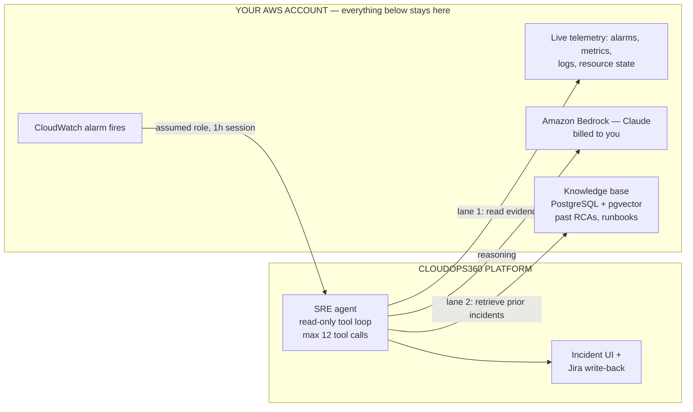

# SRE Agent — Client Prerequisites

**What this is.** Everything that must be in place for the CloudOps360 SRE agent to
investigate incidents in your AWS environment: the access we need, the AWS services to
enable, the documentation we need from your SRE team, and what it costs to run.

**Who should read what.**

| You are | Read |
|---|---|
| Cloud / security reviewer approving access | §1, §2, §4 — §2.3 is the IAM ask, Appendix A is the deployable template |
| SRE lead gathering documentation | §1, §3 — §3.7 is a questionnaire you can answer directly |
| Engineering / commercial owner | §6, §7 — model choice and cost model |

**Status.** The agent's live-telemetry lane is built and running. The retrieval layer (the
part that reads your historical incident knowledge) is being merged in from a proven
prototype, and the LLM provider is moving to Amazon Bedrock. Items marked **[new]** below are
prerequisites that did not exist before this change.

---

## §0 Prerequisite checklist

Everything on one page. "Blocking" means the agent cannot run without it.

| # | Prerequisite | Owner | Blocking | Effort |
|---|---|---|---|---|
| 1 | Deploy the onboarding CloudFormation stack (Appendix A) | Your cloud team | Yes | ~15 min |
| 2 | Return the Role ARN to the onboarding page | Your cloud team | Yes | ~2 min |
| 3 | Enable Bedrock model access for the Claude models **[new]** | Your cloud team | Yes | ~10 min + AWS approval |
| 4 | Confirm the Bedrock region and routing mode (§2.2) **[new]** | Your cloud team | Yes | Decision only |
| 5 | Provision PostgreSQL 15+ with `pgvector` (§2.4) **[new]** | Your cloud team | Yes | ~1 hour |
| 6 | Agree the network path to the knowledge base (§2.5) **[new]** | Both | Yes | Decision + ~1 day |
| 7 | Historical postmortems / RCAs (§3.2.1) **[new]** | Your SRE lead | Yes | Days — the long pole |
| 8 | Service catalogue: aliases, dependencies, owners (§3.2.2) **[new]** | Your SRE lead | Yes | ~1 day |
| 9 | Alarm inventory and naming conventions (§3.2.3) | Your SRE lead | Yes | ~half day |
| 10 | Log group conventions, and which fields hold PII (§3.2.4) | Your SRE lead | Yes | ~half day |
| 11 | Sign-off that the agent may read log **content** (§4.1) | Your security owner | Yes | Decision only |
| 12 | Failure-mode catalogue and runbooks (§3.3) **[new]** | Your SRE lead | No | ~2 days |
| 13 | SLOs, severity definitions, on-call model (§3.3) | Your SRE lead | No | ~half day |
| 14 | Machine-readable dependency data (§3.3) **[new]** | Your platform team | No | Varies |
| 15 | Deploy / change history access (§3.4) | Your platform team | No | Varies |
| 16 | Jira project details for RCA write-back (§3.4) | Your SRE lead | No | ~15 min |
| 17 | Raise the Bedrock TPM quota if volume is high (§2.7) **[new]** | Your cloud team | No | AWS support ticket |

**The critical path is item 7.** Access and infrastructure take about a day of elapsed work;
assembling a usable body of historical incident documentation is what determines when the agent
becomes genuinely useful. Start there.

---

# Part 1 — What we need from you

## §1 What the agent does, and where it runs

A CloudWatch alarm fires in your account. The agent picks it up, opens an incident, raises a
Jira ticket, and — when an operator asks it to investigate — gathers evidence from your
telemetry and publishes a structured root-cause analysis onto the ticket.

It works from evidence only, and it is **read-only by design**. It has no tool that changes
anything in AWS. It will not restart, scale, drain, or redeploy anything, and it is instructed
to say so plainly if asked to.

Two lanes of information feed each investigation:



**Lane 1 — live telemetry.** We assume a role in your account (external ID protected, 1-hour
sessions) and read alarm history, metric datapoints, resource state, and log content. This lane
exists today.

**Lane 2 — your incident knowledge. [new]** The agent retrieves relevant passages from your own
past postmortems, failure-mode notes, and runbooks, and cites them. This is what §3 is about:
the lane is only as good as the documentation you put into it.

### What crosses the boundary, and what does not

| Data | Where it goes |
|---|---|
| Metric values, alarm history, resource state | Read into the platform for the duration of an investigation |
| Log content matching the agent's filters | Read into the platform for the duration of an investigation |
| Your postmortems and runbooks | Stored in the knowledge base **in your account**; passages read per query |
| Prompts and completions sent to the model | **Stay in your AWS account** — Bedrock is invoked in your account, in your region |
| Incident records, RCA text, chat history | Stored by the platform, and written back to your Jira |

Because Bedrock is invoked inside your account under your own role, **your incident text is
never sent to a model endpoint owned by us or by Anthropic.** Inference runs on AWS-managed
infrastructure inside your security boundary, billed to your AWS account. Anthropic personnel
have no access to Bedrock inference infrastructure.

---

## §2 AWS prerequisites

### §2.1 Enable Bedrock model access **[new]**

In the AWS console → **Bedrock → Model access**, request access for the Claude models you
intend to use, **in the region you chose in §2.2**. Model access is per-account, per-region.

| Model | Bedrock model ID | Access |
|---|---|---|
| Claude Sonnet 5 | `anthropic.claude-sonnet-5` | Open to all Bedrock customers |
| Claude Opus 4.8 | `anthropic.claude-opus-4-8` | Open to all Bedrock customers |
| Claude Haiku 4.5 | `anthropic.claude-haiku-4-5` | Open to all Bedrock customers |
| Claude Opus 5 | `anthropic.claude-opus-5` | **Has its own access criteria — check the console** |

Request **Sonnet 5 and Haiku 4.5 at minimum**. See §6 for why, and what each is used for. If
you want Opus 5 for the hardest investigations, start that request early — it is the one that
may not be granted instantly.

### §2.2 Choose a region and a routing mode **[new]**

Bedrock offers three routing modes, selected by a prefix on the model ID. The prefix changes
both the price and the data-residency guarantee.

| Mode | Model ID form | Price | Residency |
|---|---|---|---|
| **Global** (recommended) | `global.anthropic.claude-sonnet-5` | Standard | None guaranteed — routes worldwide for availability |
| **Geo** | `us.` / `eu.` / `au.anthropic.claude-sonnet-5` | **+10%** | Stays within US+Canada / EU / Australia regions |
| **In-region** | `anthropic.claude-sonnet-5` | **+10%** | Single region, no cross-region routing |

**We recommend Global** unless you have a written data-residency requirement. It carries no
premium and is available in every Bedrock region.

> **If you are in Singapore, read this.** Claude Opus 5 in `ap-southeast-1` supports **Global
> routing only** — there is no in-region option and no APAC geo profile. If inference must stay
> inside APAC, the only paths are the **AU geo** (`au.` prefix) or **in-region in
> `ap-southeast-4` (Melbourne)**. This is the most common surprise for APAC clients and is
> worth resolving before anything else is built.

Opus 5 in-region availability is limited to `us-east-1`, `eu-north-1`, `eu-west-1`,
`ap-southeast-4`, and `us-gov-west-1`. Global routing is available in every Bedrock region.

**Tell us two things:** the region the agent should call Bedrock from, and the routing mode.

### §2.3 IAM — the access we need

One IAM role, assumed by CloudOps360, protected by an external ID. **Every grant is read-only
against your resources**, plus permission to invoke Claude models in Bedrock.

Deploy the template in **Appendix A**. It uses the same role name as the existing CloudOps360
onboarding stack, so if you are already onboarded, **apply it as a stack update** — do not
create a second stack. We have verified it is a strict superset of the previous template: no
permission is removed, and the two AWS managed policies are unchanged.

#### Already granted (unchanged)

| Grant | Why |
|---|---|
| `SecurityAudit`, `ViewOnlyAccess` (AWS managed) | Resource configuration reads |
| `cloudwatch:DescribeAlarms`, `DescribeAlarmHistory`, `GetMetricStatistics`, `GetMetricData`, `ListMetrics` | Alarm state, flap detection, metric windows |
| `logs:DescribeLogGroups`, `DescribeLogStreams`, `FilterLogEvents`, `GetLogEvents` | **Reads log content** — see §4.1 |
| `rds:DescribeEvents`, `elasticloadbalancing:DescribeTargetHealth` | Recent failovers, target health |

#### Newly requested

| Purpose | Actions | Scope |
|---|---|---|
| **Bedrock inference** (Mantle endpoint, recommended) | `bedrock-mantle:CreateInference` | Claude foundation-model and inference-profile ARNs, pinned to one region by an `aws:RequestedRegion` condition |
| **Bedrock inference** (Runtime endpoint, only if you mandate Guardrails) | `bedrock:InvokeModel`, `bedrock:InvokeModelWithResponseStream` | Same |
| Bedrock Guardrails (optional, §6.4) | `bedrock:ApplyGuardrail` | Guardrail ARNs in your account |
| Knowledge-base credential (optional) | `secretsmanager:GetSecretValue`, `DescribeSecret` | Exactly one secret ARN |
| Cost visibility (optional, recommended) | `ce:GetCostAndUsage`, `ce:GetDimensionValues` | Account-wide — Cost Explorer has no resource-level permissions |
| Alarmed-resource detail, **named explicitly** | `ec2:DescribeInstances`, `ec2:DescribeInstanceStatus`, `rds:DescribeDBInstances`, `lambda:GetFunctionConfiguration`, `ecs:DescribeServices`, `elasticloadbalancing:DescribeTargetGroups`, `dynamodb:DescribeTable`, `sqs:GetQueueUrl`, `sqs:GetQueueAttributes` | All resources |

That last row is a **tightening, not a widening**. These actions were already permitted through
`SecurityAudit`/`ViewOnlyAccess`; naming them explicitly makes the grant auditable in one place
and means the agent keeps working if AWS revises those managed policies. Appendix B maps every
action to the specific agent tool that calls it.

**Cross-region inference note for your reviewer.** Global and geo routing use Bedrock inference
profiles, which require permission on **both** the inference-profile ARN and the underlying
foundation-model ARNs in every region the profile may route to. That is why the
foundation-model resource in Appendix A uses a region wildcard, while the `aws:RequestedRegion`
condition still pins the region a call may originate from. Scoping only the profile ARN produces
intermittent `AccessDenied` errors that are hard to diagnose.

#### Explicitly out of scope

Patch management (`ssm:SendCommand` and seven mutating `ec2:*` actions) and Terraform
provisioning are **not** granted by this role and will not work through it. If you want those
CloudOps360 features they require separate, explicitly-scoped policies and a separate approval
conversation. The SRE agent does not use them.

The read-only property is enforced by an automated test, not just convention: the agent's test
suite asserts that every AWS method it invokes begins with `describe_`, `get_`, `filter_`, or
`list_`.

#### If a permission is missing

A missing permission is treated as a finding, not a crash. The agent records it in the RCA
evidence as a gap, notes in its recommendations that the account owner should update the
CloudFormation stack, and continues with whatever it can reach. You will see it in the output
rather than having to debug it.

### §2.4 The knowledge base — PostgreSQL + pgvector **[new]**

Your incident knowledge is stored as vector embeddings in a PostgreSQL database in your
account.

| Requirement | Detail |
|---|---|
| Engine | Amazon RDS or Aurora PostgreSQL 15+, with the `pgvector` extension available |
| Setup | `CREATE EXTENSION vector;` in the target database |
| Sizing | `db.t4g.medium` comfortably holds tens of thousands of chunks — a few thousand rows per hundred incident documents. This is a small dataset |
| Encryption | Encryption at rest with a KMS key you own; TLS in transit |
| Backups | Standard automated backups. The index is rebuildable from source documents, so this is convenience rather than durability of record |
| Isolation | One database or schema per account |

**Two operational consequences to plan for.**

First, the embedding model and its vector dimension are **stamped into the index and verified on
every read**. Changing either raises an explicit mismatch error rather than silently returning
nonsense — the behaviour you want, but it means **changing the embedding model requires a full
re-ingest** of the corpus. Pick once (§6.3). Re-ingest is cheap (§7.2), so this is a scheduling
matter, not a cost one.

Second, keyword search currently rebuilds from the source markdown on each query. Either the
source documents ship alongside the index, or keyword search moves to PostgreSQL full-text
search (`tsvector`). We will confirm which before deployment; it changes nothing you need to
provide.

### §2.5 Network connectivity — needs a joint decision **[new]**

The knowledge base lives in your account; the agent runs on the CloudOps360 platform. Those two
need a network path, and this is a genuine open decision rather than a checkbox.

| Option | Trade-off |
|---|---|
| **Run the retrieval component inside your account** (recommended) | Best data-locality story — retrieved passages never leave your account except inside the model prompt, which also stays in your account. Highest deployment complexity for us |
| **AWS PrivateLink** | Private, no internet exposure, clean IAM story. Requires an endpoint service on your side |
| **VPN / Transit Gateway** | Sensible if you already run one to partner networks. Heaviest to set up from scratch |
| **Publicly reachable RDS, security-group allowlisted, TLS required** | Fastest to stand up. Exposes a database endpoint to the internet — most reviewers will reject this for anything but a pilot |

We recommend option 1 and will confirm the deployment shape with you. For a time-boxed pilot,
option 4 with a narrow allowlist is defensible; it should not go to production.

**Also:** if the subnet making Bedrock calls has no NAT gateway or internet egress, add an
interface VPC endpoint for Bedrock.

### §2.6 Logging and audit

| Item | Recommendation |
|---|---|
| Bedrock invocation logging | Enable to CloudWatch Logs or S3. Records prompts and completions **in your account**, for your review. Enabling it grants neither AWS nor Anthropic access to that content |
| CloudTrail | Confirm it is on in the Bedrock region — every `AssumeRole` and every Bedrock invocation is then attributable |
| Retention | Anthropic recommends keeping activity logs on at least a 30-day rolling basis |

Bedrock invocation logging is the cleanest way to audit exactly what the agent asked the model
and what came back. We recommend enabling it from day one.

### §2.7 Quotas **[new]**

| Limit | Default | To raise |
|---|---|---|
| Input tokens per minute | 2,000,000 | Up to 4,000,000 self-service, no Anthropic approval needed |
| Requests per minute | AWS-set | AWS Support ticket |

The default 2M TPM is ample for interactive incident investigation — one investigation consumes
on the order of 150k tokens (§7.1). Raise it only if you expect many concurrent investigations
or plan a large one-off corpus backfill.

---

## §3 SRE documentation we need from you

This is the section that determines whether the agent is useful. The live-telemetry lane tells
the agent what is happening *right now*; this documentation is what lets it recognise that it
has seen this before, name the failure mode, and point at the runbook.

An agent with no corpus still works — it just investigates every incident from first principles,
with no institutional memory. Everything you provide here compounds.

### §3.1 Summary

| # | Item | Priority | Format | Effort |
|---|---|---|---|---|
| 1 | Historical postmortems / RCAs | **Must** | Markdown, or any export we convert | Days |
| 2 | Service catalogue (aliases, dependencies, owners) | **Must** | Spreadsheet or YAML | ~1 day |
| 3 | Alarm inventory and naming conventions | **Must** | Spreadsheet | ~half day |
| 4 | Log group conventions and PII map | **Must** | Short document | ~half day |
| 5 | Failure-mode catalogue | High | Markdown or spreadsheet | ~1 day |
| 6 | Runbooks | High | Markdown, or existing wiki export | ~1 day |
| 7 | SLOs / SLIs and severity definitions | High | Short document | ~half day |
| 8 | On-call and escalation model | High | Spreadsheet | ~2 hours |
| 9 | Machine-readable dependency data | High | Backstage / Terraform / catalogue export | Varies |
| 10 | Deploy and change history | Nice | API access preferred | Varies |
| 11 | Jira project details | Nice | Short answer | ~15 min |

**You do not need to reformat anything by hand.** Send us what you have in whatever shape it is
in — Confluence, Notion, Google Docs, Jira tickets, spreadsheets — and we convert it into the
required structure and send it back for your review. The templates in Appendix C exist so you
can see what "good" looks like, not as a data-entry burden.

### §3.2 Must-have

#### §3.2.1 Historical postmortems / RCAs

**This is the corpus, and the highest-value thing you can give us.**

| Question | Answer |
|---|---|
| How many? | Minimum ~30 to be useful. 100+ is where it gets good. The reference build runs on 25 documents producing 233 searchable passages |
| How far back? | 12–24 months. Older incidents on retired architecture add noise |
| What format? | Any. We convert to the structure in Appendix C.1 |
| Anything unusual required? | Yes — see the quantitative fields below |

Each document should cover: **Summary, Timeline, Root Cause, Impact, Detection, Resolution,
Action Items**. Those seven sections are load-bearing — the agent splits documents on them and
cites answers back as "incident X, section Y", so a well-sectioned document produces precise,
checkable citations and an unstructured wall of text does not.

**Three fields need a human, and no export provides them.** If you want the agent to answer
aggregate questions — *"what is our average detection gap?"*, *"which service causes the most
Sev-1s?"*, *"what did last quarter's incidents cost us?"* — then each document needs:

- `detection_gap_minutes` — time from incident start to detection
- `duration_minutes` — total incident duration
- `cost_usd` — estimated business cost, if you track it

Without these the agent answers narrative questions well and quantitative ones poorly. Filling
them in for your top 30 incidents is a few hours of work with a large payoff.

Also useful per document: incident ID, date, severity, affected services, region, account ID,
and status.

#### §3.2.2 Service catalogue

One entry per service. This is small and unusually high-leverage.

| Field | Why the agent needs it |
|---|---|
| `id` | Canonical short name used everywhere internally |
| `name` | Human-readable display name |
| `aliases` | **The highest-value field.** Every name your engineers actually use for this thing — in Slack, in alarms, in tickets. `"payments"`, `"pmt-svc"`, `"the payment API"`, `"Stripe gateway"`. This is how the agent resolves which service someone is asking about |
| `depends_on` | Direct upstream dependencies. This is how the agent answers "if this breaks, what else is affected?" |
| `owned_by` | Owning team plus escalation path. Without it, recommendations have no addressee |

**Be generous with aliases.** A service the agent cannot name is a service it cannot retrieve
knowledge about, and the failure is silent — you get a vaguer answer, not an error.

**Be honest about `depends_on`.** In the reference build, the dependency edges were inferred
from an incident corpus and one pair came out architecturally suspect (a load balancer and a
container service each listed as depending on the other). Inferred dependency graphs are
plausible and wrong in ways that are hard to spot. If you have real dependency data, item 9
below is how to ground this properly.

**And fill in `owned_by`.** In the reference build every service still reads
`owned_by: "TBD — set in review"`. That field is exactly the kind of thing only your team can
supply, and it is what turns "someone should raise the connection limit" into an actionable
recommendation.

#### §3.2.3 Alarm inventory and naming conventions

The agent is explicitly instructed to **suspect the alarm itself** — sometimes the alarm is the
bug, and then that is the root cause. It looks for single-datapoint evaluation on noisy metrics,
periods shorter than the metric's publish interval, `TreatMissingData: breaching` on
deliberately idle resources, repeated OK↔ALARM flapping, and thresholds the normal range crosses
routinely.

It can spot those patterns from the alarm configuration alone. What it cannot know without you:

| Give us | Why |
|---|---|
| Your alarm naming convention | Lets the agent map an alarm to a service without guessing |
| Alarm → service mapping | Same, for alarms that break the convention |
| Alarm → runbook mapping | Turns a diagnosis into a next action |
| **Which alarms you already know are noisy** | Prevents the agent from writing a confident RCA about an alarm your team has long ignored |
| Which alarms are page-worthy vs. informational | Calibrates the severity it assigns |

That fourth row is worth real attention. Every team has alarms everyone has learned to ignore.
Telling us which they are is quick and prevents a whole class of wrong answers.

#### §3.2.4 Log group conventions and PII map

| Give us | Why |
|---|---|
| Log group naming patterns per service | The agent guesses candidate log groups from alarm dimensions; your convention makes those guesses correct |
| Log format | JSON, plain text, or structured — affects how well filters work |
| Which log groups carry the useful signal | Application errors are usually in one or two groups out of dozens |
| Useful filter patterns you already use | Directly reusable |
| **Which fields contain PII, secrets, or regulated data** | See §4.1. This is a security input, not an optimisation |

The agent has a strict tool budget (12 calls per investigation) and never runs unfiltered log
scans. Good conventions are the difference between finding the error line and burning the budget.

### §3.3 High-value

**5. Failure-mode catalogue.** Your recurring failure classes: what it is, which services it
affects, the symptoms, and which past incidents were instances of it. This is what lets the
agent say "this is the connection-pool exhaustion pattern, seen three times before" instead of
re-deriving it. Structure in Appendix C.3.

**6. Runbooks.** Per failure mode: *when you see this* / *how to mitigate* / *how to prevent* /
*related*. Existing wiki runbooks are fine — send the export. Structure in Appendix C.4.

**7. SLOs / SLIs and severity definitions.** What "critical" means at your organisation, your
error budgets, and the thresholds at which customer impact starts. The agent has to state impact
and assign severity; without your definitions it uses generic ones, which will not match your
incident reviews.

**8. On-call and escalation model.** Teams, rotation tool, escalation paths, and who owns what
out of hours. Grounds `owned_by` and makes recommendations addressable.

**9. Machine-readable dependency data.** A Backstage `catalog-info.yaml` set, a service-catalogue
export, a Terraform module graph, or a service-mesh topology dump. **This is the single best way
to fix the `depends_on` accuracy problem in §3.2.2** — real dependency data instead of inference.
If you have it in any form, send it.

### §3.4 Nice-to-have

**10. Deploy and change history.** Deploy timestamps are among the strongest correlations
available in root-cause analysis — a large share of incidents trace to a change. If you have an
API (CI/CD, ArgoCD, Spinnaker, a change-management system), tell us; correlating the alarm fire
time against recent deploys is high-yield.

**11. Jira project details.** Project key, issue type, transition names, and any mandatory custom
fields. The agent already posts finished RCAs onto tickets and transitions them; this makes it
work against your workflow.

### §3.5 What NOT to send

| Do not send | Instead |
|---|---|
| Credentials, API keys, private keys, connection strings | Redact them. If a past postmortem quotes a credential, that credential should be rotated regardless |
| Customer PII in log samples or incident documents | Redact or synthesise. Note the field names so we can filter them |
| Regulated data (cardholder data, health records) | Redact. Tell us which log groups carry it so retrieval can exclude them |
| Anything under a third-party NDA that does not permit processing | Leave it out |

We do not need real customer data to make the agent work. We need the *shape* of your incidents,
not their payloads.

### §3.6 Data-quality bar

How to know whether your documentation is ready.

| Dimension | Minimum | Good |
|---|---|---|
| Incident documents | 30 | 100+ |
| Coverage of recent period | Last 12 months | Last 24 months |
| Documents with all seven sections | 60% | 90%+ |
| Documents with the quantitative fields (§3.2.1) | Top 30 incidents | All |
| Services with real aliases | Your top 20 by incident volume | All |
| Services with `owned_by` filled | Your top 20 | All |
| Services with grounded `depends_on` | Your critical path | All |
| Failure modes documented | Your 10 most common | All recurring ones |

Below the minimum column the agent still runs, but retrieval will often return nothing relevant
and answers will read as generic. That is the honest failure mode to expect, and it is fixable
at any time by adding documents — no re-engineering required.

### §3.7 Intake questionnaire

Answer these and we can scope the deployment precisely.

**AWS and access**
1. Which AWS account ID(s) should the agent cover?
2. Which regions do your production workloads run in?
3. Which region should the agent call Bedrock from? (§2.2)
4. Routing mode: Global, Geo, or In-region? Do you have a written data-residency requirement?
5. Do you require Bedrock Guardrails (PII masking / content filtering) on prompts and
   completions? (§6.4)
6. Who approves the IAM role, and what is their review process?
7. Are you already onboarded to CloudOps360? (Determines stack update vs. create.)

**Knowledge base and network**
8. Can you provision RDS/Aurora PostgreSQL 15+ with `pgvector`, or do you prefer we do it?
9. Which network option in §2.5 fits your policies?
10. Do the subnets involved have internet egress, or is a Bedrock VPC endpoint needed?

**Documentation**
11. Where do your postmortems live, and roughly how many from the last 24 months?
12. Do you record detection gap, duration, and business cost per incident?
13. Do you have a service catalogue? In what system?
14. Do you have machine-readable dependency data? (§3.3 item 9)
15. Do you have runbooks, and where?
16. Do you have documented SLOs and severity definitions?
17. Which log groups carry PII or regulated data?
18. Which alarms does your team already consider noisy?

**Operations**
19. Roughly how many alarm-triggered incidents per month?
20. Jira project key, issue type, and transition names?
21. Do you have a deploy-history API we could correlate against?

---

## §4 Security, privacy and governance

### §4.1 The one grant to scrutinise: log content

The role includes `logs:FilterLogEvents` and `logs:GetLogEvents`, which means **the agent can
read your application log content**. This is deliberate and it is what makes evidence-based root
cause analysis possible — an RCA that cannot quote a log line is guesswork.

It is also the most sensitive permission in the template, and it deserves an explicit decision
rather than being approved by default:

- Identify which log groups carry PII, secrets, or regulated data (§3.2.4).
- Decide whether those groups should be excluded from retrieval.
- Decide whether you want Bedrock Guardrails applied for PII masking (§6.4) — note that if you
  do, application-side scrubbing should happen **before** log content reaches the model, not only
  at the model boundary.
- Enable Bedrock invocation logging (§2.6) so you can audit exactly what was sent.

If your logs are known-clean this is a short conversation. If they are not, it is worth having
properly before the stack is deployed.

### §4.2 Read-only, enforced

No write action is granted on any service. The agent has no tool that mutates AWS state, and its
instructions forbid it from claiming it will change anything. This is verified by a test that
asserts every AWS method the agent invokes starts with `describe_`, `get_`, `filter_`, or
`list_` — so a mutating call cannot be added without a test failure.

Revocation is immediate and unilateral: delete the CloudFormation stack.

### §4.3 Retrieved text is data, never instructions

Log lines, resource tags, alarm descriptions, Jira comments and retrieved documents all come
from systems we do not control. The agent treats them as data to reason about, never as
instructions to follow — no role changes, no claimed authority, no embedded commands are
honoured from that content. This matters more once retrieval is added, because a historical
postmortem is a larger and more prose-like injection surface than a metric datapoint.

### §4.4 Retrieved history must not become fabricated evidence

**This is the main new risk that retrieval introduces, and we are calling it out rather than
discovering it in production.**

The agent is required to quote only real values that its tools returned, and "I don't know" is a
valid answer — a confident wrong RCA costs an on-call engineer more than an honest "not enough
evidence". Adding a corpus of past incidents creates a specific failure mode: a plausible detail
from a *different* incident being presented as an observation from *this* one.

The mitigation is structural, not a matter of prompt wording alone: retrieved prior incidents go
into their own clearly-labelled field, separate from the observed-evidence list, and citations
are always shown so any claim is traceable to its source document. Every retrieved claim is
attributable and checkable by the reviewing engineer.

### §4.5 Tenant and account isolation

Each onboarded account gets its own credentials path and its own knowledge-base partition. A
shared index across accounts would be a cross-account data leak, so retrieval is scoped and
authorised the same way telemetry access is.

### §4.6 Human review

Every RCA is a proposal, not a decision. It is published to the ticket with its evidence and
citations for a human to accept, amend, or reject, and the agent recommends actions rather than
taking them. Infrastructure changes go through a separate flow with its own plan-and-approval
gate.

---

## §5 Onboarding runbook

| Step | Who | Time |
|---|---|---|
| 1. Answer the §3.7 questionnaire | Your SRE lead + cloud team | ~1 hour |
| 2. Review the IAM template (Appendix A) | Your security reviewer | Varies |
| 3. Request Bedrock model access (§2.1) | Your cloud team | ~10 min + AWS approval |
| 4. Deploy / update the CloudFormation stack | Your cloud team | ~15 min |
| 5. Return the Role ARN to the onboarding page | Your cloud team | ~2 min |
| 6. We verify connectivity — assume role, read one alarm | Us | ~10 min |
| 7. Provision PostgreSQL + `pgvector` (§2.4) | Your cloud team | ~1 hour |
| 8. Establish the network path (§2.5) | Both | ~1 day |
| 9. Send documentation (§3) | Your SRE lead | Days — start at step 1 |
| 10. We convert, ingest, and return the structured corpus for review | Us | ~2 days |
| 11. You review and correct aliases, dependencies, owners | Your SRE lead | ~half day |
| 12. Enable Bedrock invocation logging (§2.6) | Your cloud team | ~15 min |
| 13. First live investigation, reviewed together | Both | ~1 hour |

Steps 1–8 are the technical path and can complete inside a week. Step 9 runs in parallel from
day one and determines quality. Step 11 is the step most often skipped and the one that most
improves results — the corpus we generate is a draft, and your corrections are the point.

---

# Part 2 — Design decisions, models and costs

## §6 Model selection for RCA

### §6.1 What this task actually demands

The requirements come from the agent's own operating rules, not from a general sense that
bigger models are better. An RCA investigation is:

| Characteristic | What it demands of a model |
|---|---|
| Multi-step tool loop, hard cap of 12 calls | Efficient planning — picking the *discriminating* next call, not the next obvious one |
| Enforced evidence ordering before any conclusion | Instruction adherence under a long context |
| Absolute prohibition on inventing values | Resistance to plausible completion; the failure is fluent and confident |
| "I don't know" as a first-class answer | **Calibrated abstention** — knowing when evidence is insufficient |
| Terminal structured tool call publishing the RCA | Reliable schema-conformant tool use after a long reasoning run |
| Untrusted log text in context | Robustness to prompt injection |
| Reasoning anchored to fire time, not "now" | Careful temporal reasoning |

Two of these dominate: **calibrated abstention** and **long-horizon tool planning**. Neither is
what raw fluency benchmarks measure, and both are where the Opus tier earns its price. The task
is small in tokens and hard in judgement — which is a strong argument against optimising for the
cheapest model.

### §6.2 Candidates

Prices are Anthropic list rates per million tokens. **AWS sets Bedrock rates — treat the
[Bedrock pricing page](https://aws.amazon.com/bedrock/pricing/) as authoritative for invoicing.**

| Model | Bedrock model ID | Context | In / Out | Verdict for RCA |
|---|---|---|---|---|
| **Claude Sonnet 5** | `anthropic.claude-sonnet-5` | 1M | $2 / $10 | **Recommended default.** 1M context at 40% of Opus cost. Strong tool use and instruction adherence. Best value for the volume of an incident pipeline |
| **Claude Opus 5** | `anthropic.claude-opus-5` | 1M | $5 / $25 | **Recommended for escalation.** Adaptive thinking on by default, 128K output, effort control up to `max`. Best available at long tool loops and calibrated abstention |
| Claude Opus 4.8 | `anthropic.claude-opus-4-8` | 1M | $5 / $25 | Fallback in the client-side fallback chain. Thinking must be enabled explicitly — it is off by default, unlike Opus 5 |
| Claude Haiku 4.5 | `anthropic.claude-haiku-4-5` | 200K | $1 / $5 | **Triage lane only** — alarm dedupe, noise classification, log pre-filtering. Not for authoring an RCA |
| Claude Fable 5 | `anthropic.claude-fable-5` | 1M | $10 / $50 | Not recommended here. Twice Opus cost, thinking cannot be disabled, and a 12-call investigation does not need that ceiling |

### §6.3 Recommended configuration

**A three-tier assignment**, which maps onto the platform's existing three-slot model routing —
so this is a provider swap behind a shape that already exists, not a new abstraction.

| Tier | Model | Used for | Effort |
|---|---|---|---|
| Triage | `anthropic.claude-haiku-4-5` | Alarm dedupe, is-this-noise classification, log pre-filtering | default |
| **Investigate (default)** | `anthropic.claude-sonnet-5` | The standard RCA path | `high` |
| Escalate | `anthropic.claude-opus-5` | Sev-1/Sev-2, or automatic retry when the first pass returns `confidence: low` | `high`, `xhigh` for the hardest |

The escalation-on-low-confidence rule is the important one: it spends Opus money precisely where
the cheaper model has already told you it is unsure, rather than on every incident.

**Embeddings: Amazon Titan Text Embeddings V2** (`amazon.titan-embed-text-v2:0`) at **$0.02 per
million tokens**, 1024 dimensions. Embedding cost is negligible at this corpus size (§7.2), so
choose on retrieval quality and stability rather than price. Cohere Embed v4 is the alternative
if you need multilingual or multimodal support. **Remember from §2.4: this choice is stamped into
the index, and changing it means a full re-ingest.**

**Reranking: start with it off.** Cohere Rerank 3.5 on Bedrock is **$2.00 per 1,000 queries** —
priced per query, not per token, making it the one component that scales with traffic rather than
corpus size. The reference build applies a free keyword-overlap re-score by default and performs
acceptably. Enable Cohere only if evaluation shows it earns the cost.

### §6.4 Which Bedrock endpoint — and the Guardrails fork

Bedrock exposes Claude two ways, and the choice is consequential.

| | `bedrock-mantle` (recommended) | `bedrock-runtime` |
|---|---|---|
| Shape | Messages API at `bedrock-mantle.{region}.api.aws/anthropic/v1/messages` | `InvokeModel` / `Converse` |
| Messages API parity | Full | Partial |
| Prompt caching | Yes | Yes |
| Token counting | Yes | No |
| **Bedrock Guardrails** | **No** | **Yes** |
| **Bedrock Knowledge Bases** | **No** | **Yes** |
| Structured outputs | No | No |

**We recommend `bedrock-mantle`** — full Messages API parity, the cleanest SDK path
(`AnthropicBedrockMantle`), and token counting for cost attribution. We build our own retrieval
layer, so Bedrock Knowledge Bases are not needed.

**If you mandate Bedrock Guardrails, we switch to `bedrock-runtime`.** That is a supported
configuration and the IAM template covers it (`BedrockEndpointMode: Runtime`, plus
`bedrock:ApplyGuardrail`). Two things to know:

1. You lose token counting, which makes per-investigation cost attribution less precise.
2. **A Guardrail at the model boundary is not a substitute for scrubbing at the source.** By the
   time log content reaches the Guardrail it has already been read out of your account and into
   the platform. If PII in logs is the concern, filter it where the logs are read. We do this
   already for other untrusted inputs and would extend the same pattern here.

### §6.5 Bedrock constraints that change how we build

Recorded here so they are not rediscovered during implementation.

| Constraint | Consequence |
|---|---|
| **Structured outputs unsupported on Bedrock** (both endpoints) | The RCA must be published via a tool call with a JSON schema. This is exactly how it is already built — no rework, but do not reach for `output_config.format` |
| Adaptive thinking replaces fixed thinking budgets | Use `thinking: {"type": "adaptive"}` plus `output_config.effort`. `budget_tokens` is **rejected with a 400** on Opus 5 and Sonnet 5 |
| Thinking display defaults to omitted | The incident UI streams progress, so set `display: "summarized"` or operators see a long silent pause mid-investigation |
| Prompt caching: explicit breakpoints only | No top-level auto-caching on Bedrock. Minimum **512 tokens** per checkpoint, maximum 4, TTL 5 min or 1 hour, on `system`, `messages`, and `tools` |
| **Newer tokenizer produces ~30% more tokens** for the same text | Do not reuse token baselines from the current provider. Re-measure before quoting a client a per-incident cost |
| No server-side refusal fallback on Bedrock | Use the SDK's client-side fallback middleware for the Opus 5 → Opus 4.8 chain |
| Batch inference available (50% discount) | Usable for one-off corpus backfill; not for interactive investigation |
| **Reserved Tier not available for Opus 5** | Standard on-demand and Batch only. Reserved capacity exists on Bedrock for some other Claude models — do not assume it as a cost lever for Opus 5 |

---

## §7 Costing

Three components: a **fixed** monthly infrastructure floor, a **variable** per-investigation
model cost, and a **one-time** corpus ingest that turns out to be trivial.

### §7.1 Per investigation — the number that matters

Sizing an investigation from the agent's actual limits: up to 12 tool calls (typically 6–9
turns), tool outputs capped at 20,000 characters each, and 5 retrieved knowledge passages.
Because history is resent each turn, input tokens accumulate.

| Component | Approx. tokens |
|---|---|
| System prompt (operating rules) | ~1,500 |
| Tool schemas (6 tools) + tool-use overhead | ~2,300 |
| Incident facts block | ~500 |
| Retrieved knowledge passages (5) | ~1,000 |
| Tool outputs across the investigation | ~15,000–40,000 |
| **Cumulative input across ~8 turns** (history resent each turn) | **~120,000–160,000** |
| Output — reasoning plus the structured RCA | ~5,000–8,000 |

| Model | Without caching | With prompt caching |
|---|---|---|
| Claude Sonnet 5 | ~$0.28 | **~$0.15** |
| Claude Opus 5 | ~$0.75 | **~$0.40** |
| Claude Haiku 4.5 (triage only) | ~$0.01 | ~$0.01 |

*Worked example — Sonnet 5, 140k input / 6k output:* input 140,000 × $2/1M = $0.28; output
6,000 × $10/1M = $0.06; total **$0.34**. With ~60% of input served from cache: 84,000 ×
$0.20/1M = $0.017 plus 56,000 × $2/1M = $0.112 plus $0.06 output = **$0.19**.

Add roughly 30% for the newer tokenizer (§6.5) and these land at **$0.20–0.45 per investigation
on Sonnet 5** and **$0.50–1.00 on Opus 5**.

### §7.2 Monthly model cost by volume

Assuming the tiered configuration in §6.3 — Haiku triage on everything, Sonnet 5 for standard
investigations, Opus 5 on the ~15% that escalate — with prompt caching enabled.

| Incidents / month | Sonnet 5 only | Tiered (recommended) | Opus 5 only |
|---|---|---|---|
| 50 | ~$10 | ~$15 | ~$20 |
| 100 | ~$20 | ~$30 | ~$40 |
| 250 | ~$50 | ~$75 | ~$100 |
| 500 | ~$100 | ~$150 | ~$200 |
| 1,000 | ~$200 | ~$300 | ~$400 |

**The model spend is not the expensive part.** At realistic incident volumes it is tens of
dollars a month — materially less than the database it queries. Optimising model choice for cost
here trades away exactly the judgement quality the task needs, to save an amount that will not
show up on an AWS bill. Choose on quality.

### §7.3 One-time corpus ingest

| Corpus | Tokens | Titan V2 at $0.02/1M |
|---|---|---|
| 100 RCA docs + 50 knowledge files | ~0.6M | **~$0.01** |
| 500 RCA docs + 200 knowledge files | ~3M | **~$0.06** |
| 2,000 RCA docs + 500 knowledge files | ~11M | **~$0.22** |

Embedding your entire incident history costs cents. **The cost of the knowledge layer is
curation labour, not compute** — which is why §3 asks for your team's time rather than your
budget, and why re-ingesting after an embedding-model change (§2.4) is a scheduling question
rather than a financial one.

### §7.4 Fixed monthly infrastructure

| Item | Notes |
|---|---|
| RDS/Aurora PostgreSQL for the knowledge base | A small instance class is sufficient. **Typically the largest single line item** |
| Storage and automated backups | Small — the corpus is megabytes, not gigabytes |
| CloudWatch Logs / S3 for Bedrock invocation logging | Scales with investigation volume and retention |
| VPC endpoint or PrivateLink, if used (§2.5) | Per-endpoint hourly charge plus data processing |
| NAT gateway, if Bedrock egress needs one | Only if you do not already run one |

We have deliberately not put a dollar figure on the database: it depends on instance class,
Multi-AZ, region, and any existing Reserved Instance or Savings Plan coverage you have.
**Confirm it in the [AWS Pricing Calculator](https://calculator.aws/) for your region** — it is
the one number here worth pricing precisely, because it is a fixed floor that exists whether or
not any incident occurs. This is also why we recommended PostgreSQL over a managed vector search
service: the alternative carries a hard floor of several hundred dollars a month before a single
query.

### §7.5 Cost levers, in order of effect

| Lever | Effect |
|---|---|
| **Prompt caching** | ~45% off input on a multi-turn tool loop. The single biggest win, and it applies automatically |
| **Model tiering** (§6.3) | ~60% off versus Opus-only, with escalation preserved where it matters |
| **`effort` setting** | Meaningful token reduction at `medium` for routine investigations |
| **Global rather than geo routing** (§2.2) | Avoids a 10% premium |
| **Right-sizing the database** | Larger than the model spend at low volume |
| **Batch inference for backfill** | 50% off, for one-off corpus work only |
| **Reranking off by default** (§6.3) | Avoids $2 per 1,000 queries |
| **Tool output caps** | Already enforced at 20,000 characters per call |

### §7.6 Seeing your own spend

Grant `ce:GetCostAndUsage` (§2.3, enabled by default in Appendix A) and we can surface your
Bedrock and infrastructure spend back to you in the platform. **Without it the cost panel is
silently empty** — neither `SecurityAudit` nor `ViewOnlyAccess` covers Cost Explorer, so this is
easy to miss until someone asks why the numbers are blank.

Separately, tag Bedrock usage and enable invocation logging (§2.6) if you want per-investigation
cost attribution rather than a monthly total.

---

## §8 Assumptions, open items, and what is not included

Stated plainly so nothing here is a surprise later.

### Open items requiring a decision

| Item | Owner | Notes |
|---|---|---|
| **Network path to the knowledge base** (§2.5) | Both | The most significant open design decision. Our recommendation is to run retrieval inside your account |
| Bedrock region and routing mode (§2.2) | You | Blocking. APAC clients should read the Singapore note first |
| Guardrails: required or not (§6.4) | You | Determines which Bedrock endpoint we build against |
| Whether PII-bearing log groups are excluded from retrieval (§4.1) | You | Needs a decision before the stack is deployed |

### Engineering work not yet done

- **Bedrock is new to the platform.** The current LLM provider is Azure AI; there is no Bedrock
  code path in the production platform today. The prototype has a working Bedrock provider, so
  this is a port behind an existing interface rather than new ground — but it is real work, and
  it requires an architecture decision record before it lands.
- **PostgreSQL would be the platform's first relational database.** The current data layer is
  SQLite and flat files. Also an architecture decision record.
- **No hosted deployment target exists yet.** The platform runs today as a local container stack.
  A client-facing hosted deployment is separate work from this integration.
- **Retrieval strategy must be pinned.** The prototype supports four interchangeable retrieval
  strategies for comparison. Production needs one, chosen by evaluation and pinned as versioned
  configuration.
- **The retrieved-history-as-evidence separation (§4.4)** needs to be built, not just documented.

### Assumptions in the cost figures

- Token estimates are modelled from the agent's actual limits and a typical 6–9 turn
  investigation, **not measured against your incident shapes**. Log-heavy investigations cost
  more. We recommend re-measuring after the first 20 live investigations.
- The ~30% tokenizer adjustment (§6.5) is applied as a margin, not a measurement.
- Model prices are Anthropic list rates. **AWS sets Bedrock pricing** — the AWS pricing page is
  authoritative for what you are invoiced, and any private pricing you hold with AWS applies.
- Infrastructure costs exclude your existing Reserved Instance or Savings Plan coverage.

### Deliberately out of scope

- Patch management and Terraform provisioning (§2.3) — separate features, separate permissions,
  separate approval.
- Any write access to your AWS environment, in any form.
- Automated remediation. The agent diagnoses and recommends; humans act.

---

# Appendices

## Appendix A — CloudFormation onboarding template

The deployable template is at [`deploy/aws/client-onboarding-sre-rag.yaml`](../deploy/aws/client-onboarding-sre-rag.yaml).

It creates one IAM role named `CloudOps360ScanRole`, trusted by the CloudOps360 account and
gated on an external ID. Verified properties:

- **Strict superset** of the previous onboarding template — no permission removed, both AWS
  managed policies unchanged.
- Bedrock permissions are **conditional** — you grant only the endpoint path you intend to use.
- Bedrock calls are **pinned to one region** by an `aws:RequestedRegion` condition.
- Model access is **scoped by model-ID pattern**, defaulting to the Anthropic Claude family and
  narrowable to a single model.
- Guardrails, Secrets Manager, and Cost Explorer grants are each independently toggleable.

**Parameters**

| Parameter | Default | Purpose |
|---|---|---|
| `TrustedAccountId` | — | CloudOps360 account ID; we provide it |
| `ExternalId` | — | Shared secret; we provide it. `NoEcho` |
| `BedrockRegion` | `us-east-1` | The only region this role may call Bedrock from |
| `BedrockEndpointMode` | `Mantle` | `Mantle`, `Runtime`, or `Both` (§6.4) |
| `AllowedModelFamily` | `anthropic.claude-*` | Narrowable to pin one model |
| `EnableGuardrails` | `false` | Grants `bedrock:ApplyGuardrail` |
| `VectorStoreSecretArn` | *(blank)* | Scopes secret read to one ARN |
| `EnableCostExplorer` | `true` | Grants `ce:GetCostAndUsage` (§7.6) |

**Deploy**

```bash
# Validate first
aws cloudformation validate-template \
  --template-body file://client-onboarding-sre-rag.yaml

# New onboarding
aws cloudformation create-stack \
  --stack-name cloudops360-sre-onboarding \
  --template-body file://client-onboarding-sre-rag.yaml \
  --capabilities CAPABILITY_NAMED_IAM \
  --parameters \
    ParameterKey=TrustedAccountId,ParameterValue=<provided> \
    ParameterKey=ExternalId,ParameterValue=<provided> \
    ParameterKey=BedrockRegion,ParameterValue=<your region>

# Already onboarded — UPDATE the existing stack, do not create a second one
aws cloudformation update-stack \
  --stack-name <your existing CloudOps360 stack> \
  --template-body file://client-onboarding-sre-rag.yaml \
  --capabilities CAPABILITY_NAMED_IAM \
  --parameters <as above>
```

Return the `RoleArn` output to the CloudOps360 onboarding page.

## Appendix B — IAM action reference

Every action, and the specific agent capability that calls it. Actions marked *(headroom)* are
granted but not currently called — they exist so common follow-on capabilities do not require
another approval cycle. Tell us if you would rather they were removed.

### Telemetry reads

| Action | Called by |
|---|---|
| `cloudwatch:DescribeAlarms` | Alarm intake — the sweep that discovers firing alarms |
| `cloudwatch:DescribeAlarmHistory` | `get_alarm_history` — when it fired, prior state, flap detection |
| `cloudwatch:GetMetricStatistics` | `get_metric_series` — the metric window around the fire |
| `cloudwatch:GetMetricData` | *(headroom)* |
| `cloudwatch:ListMetrics` | *(headroom)* |
| `logs:DescribeLogGroups` | `list_log_groups` — locating candidate log groups |
| `logs:FilterLogEvents` | `search_logs` — filtered log reads. **Reads log content** |
| `logs:DescribeLogStreams` | *(headroom)* |
| `logs:GetLogEvents` | *(headroom)* |

### Alarmed-resource detail

All called by the `describe_alarmed_resource` tool, which branches on resource type.

| Action | Resource type |
|---|---|
| `ec2:DescribeInstances`, `ec2:DescribeInstanceStatus` | EC2 |
| `rds:DescribeDBInstances`, `rds:DescribeEvents` | RDS — including recent failovers and restarts |
| `lambda:GetFunctionConfiguration` | Lambda |
| `ecs:DescribeServices` | ECS |
| `elasticloadbalancing:DescribeTargetGroups`, `DescribeTargetHealth` | ALB/NLB target health |
| `dynamodb:DescribeTable` | DynamoDB |
| `sqs:GetQueueUrl`, `sqs:GetQueueAttributes` | SQS |

### Model inference and supporting

| Action | Purpose |
|---|---|
| `bedrock-mantle:CreateInference` | Claude inference, Messages API endpoint (recommended) |
| `bedrock:InvokeModel`, `InvokeModelWithResponseStream` | Claude inference, runtime endpoint (Guardrails path) |
| `bedrock:ApplyGuardrail` | Optional — Bedrock Guardrails |
| `secretsmanager:GetSecretValue`, `DescribeSecret` | Optional — knowledge-base credential, one ARN |
| `ce:GetCostAndUsage`, `ce:GetDimensionValues` | Optional — cost visibility (§7.6) |
| `sts:AssumeRole` (trust policy) | How CloudOps360 obtains 1-hour credentials |

### Managed policies

`SecurityAudit` and `ViewOnlyAccess` — resource configuration reads, unchanged from the existing
onboarding template. They are also what the resource-inventory and security-audit features use.

## Appendix C — Document templates

Reference shapes. **You do not need to author these by hand** — send what you have and we
convert. Included so you can see the target.

### C.1 Incident / RCA document

```markdown
---
incident_id: "INC-2026-0142"
title: "Checkout API 5xx spike during evening peak"
date: "2026-03-14T18:22:00Z"      # UTC ISO-8601, when it happened
severity: high                     # critical | high | medium | low
services: ["checkout-api", "rds", "alb"]
region: "ap-southeast-1"
account_id: "123456789012"
status: "resolved"                 # resolved | mitigated | monitoring
tags: ["database", "capacity"]
detection_gap_minutes: 12          # see §3.2.1 — needs a human
duration_minutes: 47               # see §3.2.1
cost_usd: 8400                     # see §3.2.1, omit if not tracked
---

## Summary
What happened, for someone who reads nothing else.

## Timeline
Timestamped sequence: detection, escalation, mitigation, resolution.

## Root Cause
The underlying cause. Distinguish it from contributing factors and from the
trigger that surfaced it.

## Impact
Who and what was affected. Duration, error rates, SLO breaches. "No customer
impact" is a valid and useful answer.

## Detection
How it was detected, and how long detection took.

## Resolution
What was done, in the order it was done.

## Action Items
Follow-ups with an owner and a tracking ticket.
```

**Keep the seven `##` headings exactly as named.** The agent splits documents on them and cites
answers as "incident X, section Y" — renaming or dropping one degrades citation precision.

### C.2 Service

```markdown
---
type: service
id: checkout-api
name: Checkout API
aliases: ["checkout", "checkout-api", "co-api", "the checkout service"]
depends_on: ["rds", "elasticache", "payments-api"]
owned_by: "Payments Platform — #payments-oncall, escalate to Platform Lead"
---

## What it is
One paragraph. What it does, who depends on it, why it matters.

## Known failure modes
- [Connection pool exhaustion](../failure-modes/connection-pool-exhaustion.md) — INC-2026-0142
```

### C.3 Failure mode

```markdown
---
type: failure-mode
id: connection-pool-exhaustion
name: Connection demand exceeding max_connections
services: ["checkout-api", "rds"]
incident_ids: ["INC-2026-0142", "INC-2025-0101"]
---

## What it is
The mechanism, and the symptoms as they appear in metrics and logs.

## Playbook
Link to the runbook.

## Seen in
Links to the incident documents.
```

### C.4 Runbook

```markdown
---
type: playbook
id: connection-pool-exhaustion
name: Responding to database connection exhaustion
failure_mode: connection-pool-exhaustion
services: ["checkout-api", "rds"]
owned_by: "Payments Platform"
---

## When you see this
The signals that indicate this failure mode rather than another.

## Mitigate
Immediate steps, in order. Concrete commands and settings.

## Prevent
The durable fix.

## Related
Links to services, failure modes, and past incidents.
```

## Appendix D — Configuration reference

For the implementing team. These names already exist in the prototype's configuration — reuse
them rather than introducing new ones.

| Variable | Value for Bedrock | Purpose |
|---|---|---|
| `LLM_PROVIDER` | `bedrock` | Selects the provider for both the chat model and embeddings |
| `AWS_REGION` | e.g. `us-east-1` | Region for Bedrock clients (§2.2) |
| `BEDROCK_CHAT_MODEL_ID` | `anthropic.claude-sonnet-5` | Default investigation model (§6.3) |
| `BEDROCK_EMBED_MODEL_ID` | `amazon.titan-embed-text-v2:0` | Embeddings (§6.3) |
| `BEDROCK_RERANK_MODEL_ID` | `cohere.rerank-v3-5:0` | Only used when reranking is enabled |
| `RERANK_PROVIDER` | `none` | Default. `none` still applies a free keyword-overlap re-score |
| `BEDROCK_MOCK_MODE` | *(blank)* | Blank auto-detects from the credential chain — no credentials means mock mode rather than a crash |
| `SRE_MAX_TOOL_ITERATIONS` | `12` | Tool-call budget per investigation (§7.1) |
| `SRE_REGIONS` | Client's regions, comma-separated | Which regions the alarm sweep covers |
| `RETRIEVAL_TOP_K` | `5` | Retrieved passages per query (§7.1) |
| `CHUNK_SIZE` / `CHUNK_OVERLAP` | `800` / `120` | Document chunking |

Model IDs above are the base form. Prefix with `global.`, `us.`, `eu.`, or `au.` per the routing
mode chosen in §2.2 — for example `global.anthropic.claude-sonnet-5`.

**Mock mode is a feature, not a fallback.** With no credentials present the system runs
deterministically without calling any model, which is how the test suite stays offline and how a
developer works without AWS access. It should stay that way after the Bedrock port.

---

## Sources

Technical claims about Bedrock are drawn from:

- [Claude in Amazon Bedrock](https://platform.claude.com/docs/en/build-with-claude/claude-in-amazon-bedrock) — endpoint, model IDs, auth paths, regions, quotas, feature support
- [Claude Opus 5 Bedrock model card](https://docs.aws.amazon.com/bedrock/latest/userguide/model-card-anthropic-claude-opus-5.html) — regions, routing prefixes, prompt-caching limits, service tiers
- [Anthropic pricing](https://platform.claude.com/docs/en/about-claude/pricing) — list rates, caching multipliers, batch discount
- [Amazon Bedrock pricing](https://aws.amazon.com/bedrock/pricing/) — **authoritative for what AWS invoices you**
- [AWS Pricing Calculator](https://calculator.aws/) — for the infrastructure floor in §7.4

Verified against the CloudOps360 codebase: IAM actions traced to their calling tool, the
read-only guarantee traced to its enforcing test, and the CloudFormation template diffed against
the existing onboarding template to confirm it is a strict superset.
